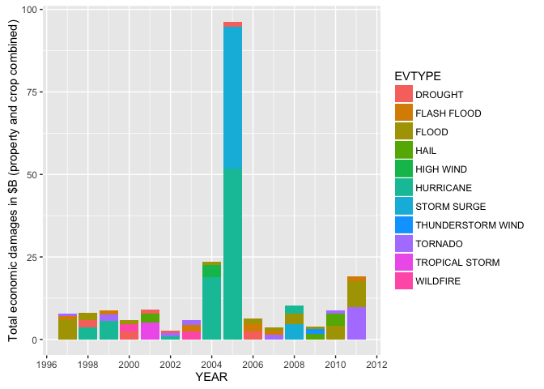

# Most harmful weather events in the USA based on the analysis of the NOAA Storm Database


##Synopsis  
The storm database from the National Oceanic and Atmospheric Administration was analysed to provide answers to the following questions:  

1. Across the United States, which types of events (as indicated in the *EVTYPE* variable) are most harmful with respect to population health?  
2. Across the United States, which types of events have the greatest economic consequences?

The data is most complete starting from year 1996, thus the analysis was concentrated on the period 1996-2011. It was found that the worst events in terms of economic impact are floods, tornados, droughts and hurricanes. Furthermore, the top three events which consistently have the most harmful effects on the population health are: tornados, excessive heat and thunderstorm winds as per combined number of fatalities and injuries that they cause. 

##Data Processing
**Note**: The analysis is **required** to start from the CSV.BZ2 file, thus downloading the data was not coded in. We first must read in the data and convert it into dataframe tbl format from dplyr package.


```r
suppressPackageStartupMessages(library(plyr))
suppressPackageStartupMessages(library(dplyr))
suppressPackageStartupMessages(library(ggplot2))
suppressPackageStartupMessages(library(lubridate))
suppressPackageStartupMessages(library(tidyr))
```


```r
stormData <- read.csv('repdata-data-StormData.csv.bz2') #read.csv can handle bz2 archives
stormData <- tbl_df(stormData)
stormData
```

```
## Source: local data frame [902,297 x 37]
## 
##    STATE__           BGN_DATE BGN_TIME TIME_ZONE COUNTY COUNTYNAME  STATE
##      (dbl)             (fctr)   (fctr)    (fctr)  (dbl)     (fctr) (fctr)
## 1        1  4/18/1950 0:00:00     0130       CST     97     MOBILE     AL
## 2        1  4/18/1950 0:00:00     0145       CST      3    BALDWIN     AL
## 3        1  2/20/1951 0:00:00     1600       CST     57    FAYETTE     AL
## 4        1   6/8/1951 0:00:00     0900       CST     89    MADISON     AL
## 5        1 11/15/1951 0:00:00     1500       CST     43    CULLMAN     AL
## 6        1 11/15/1951 0:00:00     2000       CST     77 LAUDERDALE     AL
## 7        1 11/16/1951 0:00:00     0100       CST      9     BLOUNT     AL
## 8        1  1/22/1952 0:00:00     0900       CST    123 TALLAPOOSA     AL
## 9        1  2/13/1952 0:00:00     2000       CST    125 TUSCALOOSA     AL
## 10       1  2/13/1952 0:00:00     2000       CST     57    FAYETTE     AL
## ..     ...                ...      ...       ...    ...        ...    ...
## Variables not shown: EVTYPE (fctr), BGN_RANGE (dbl), BGN_AZI (fctr),
##   BGN_LOCATI (fctr), END_DATE (fctr), END_TIME (fctr), COUNTY_END (dbl),
##   COUNTYENDN (lgl), END_RANGE (dbl), END_AZI (fctr), END_LOCATI (fctr),
##   LENGTH (dbl), WIDTH (dbl), F (int), MAG (dbl), FATALITIES (dbl),
##   INJURIES (dbl), PROPDMG (dbl), PROPDMGEXP (fctr), CROPDMG (dbl),
##   CROPDMGEXP (fctr), WFO (fctr), STATEOFFIC (fctr), ZONENAMES (fctr),
##   LATITUDE (dbl), LONGITUDE (dbl), LATITUDE_E (dbl), LONGITUDE_ (dbl),
##   REMARKS (fctr), REFNUM (dbl)
```

```r
observations <- dim(stormData)[1]
numEVTYPE <- length(levels(stormData$EVTYPE))
```

Several observations on the initial data read in:

* There is a total of 902297 observations with some 985 of different event types - very large, needs cleanup/intelligent subsetting.

* Data spans multiple years with begin and end date being factor variables. In this analysis we attribute a particular event to the year when it started and thus it is reasonalbe to append a *YEAR* column to the dataset to simplify further grouping and analysis.

Based on the information found at [Storm Events Database](http://www.ncdc.noaa.gov/stormevents/details.jsp) it is clear that the database is most complete starting from the year 1996. Considering that prior to that year only at maximum three events were recorded - Tornado, Thunderstorm Wind and Hail, it is reasonable to carry out analysis subsetting the dataset to only include years 1996-2011.  


```r
stormData <- mutate(stormData, YEAR = year(mdy_hms(BGN_DATE)))
stormData <- mutate(stormData, healthImpact = FATALITIES+INJURIES)
stormData <- filter(stormData, YEAR > 1996)
```

We are primarily looking for events that have a ***consistently*** high impact on the population health and the economy, thus we only keep those entries where every EVTYPE event had to occur on average at least once every year over the course of the period 1996-2011, i.e. at least 15 observations in total.


```r
eventsTally <- group_by(stormData, EVTYPE) %>% tally(sort=TRUE)
sigEvents <- eventsTally[eventsTally$n > 15, ]
sigEvents
```

```
## Source: local data frame [98 x 2]
## 
##               EVTYPE      n
##               (fctr)  (int)
## 1               HAIL 196981
## 2          TSTM WIND 118697
## 3  THUNDERSTORM WIND  81402
## 4        FLASH FLOOD  47754
## 5              FLOOD  23333
## 6            TORNADO  21915
## 7          HIGH WIND  18795
## 8         HEAVY SNOW  13025
## 9          LIGHTNING  12289
## 10        HEAVY RAIN  11165
## ..               ...    ...
```

Looking at the data printout for significant events (sigEvents) and consulting with page 6 of the [STORM DATA PREPARATION document](https://d396qusza40orc.cloudfront.net/repdata%2Fpeer2_doc%2Fpd01016005curr.pdf) we observe that some of the same events have different designations, e.g. 'THUNDERSTORM WIND' and 'TSTM WIND'. Data is subset using sigEvents and names are corrected.  


```r
subStormData <- filter(stormData, EVTYPE %in% sigEvents$EVTYPE)
subStormData$EVTYPE <- gsub('TSTM','THUNDERSTORM',subStormData$EVTYPE, ignore.case = TRUE)
subStormData$EVTYPE <- gsub('WINDS','WIND',subStormData$EVTYPE, ignore.case = TRUE)
subStormData$EVTYPE <- gsub('HEAT WAVE','HEAT',subStormData$EVTYPE, ignore.case = TRUE)
subStormData$EVTYPE <- gsub('HURRICANE/TYPHOON','HURRICANE',subStormData$EVTYPE, ignore.case = TRUE)
subStormData$EVTYPE <- gsub('STORM SURGE/TIDE','STORM SURGE',subStormData$EVTYPE, ignore.case = TRUE)
subStormData$EVTYPE <- gsub('WILD/FOREST FIRE','WILDFIRE',subStormData$EVTYPE, ignore.case = TRUE)
```

In order to extract economic impact data we have to convert the damage exponent column from factor class into integer, substituting K, M, B, 0 and blank with 1000, 1000000, 1000000000, 1 and 1 respectively. Zero and blank are substituted with 1 since they imply no exponent. Finally derive a new column with total economic damage for every event summing up dollar damages to property and crops.  


```r
# Create property DMG multiplier column with numerical values for property damage exponent
subStormData$PROPDMGEXP<-factor(subStormData$PROPDMGEXP)
subStormData$propDMGMult <- mapvalues(subStormData$PROPDMGEXP, 
                                      c('','0','B','K','M'),
                                      c(1, 1, 1000000000, 1000, 1000000))
subStormData$propDMGMult<-as.integer(as.character(subStormData$propDMGMult))

# Create crop DMG multiplier column with numerical values for crop damage exponent
subStormData$CROPDMGEXP<-factor(subStormData$CROPDMGEXP)
subStormData$cropDMGMult <- mapvalues(subStormData$CROPDMGEXP, 
                                      c('','B','K','M'),
                                      c(1, 1000000000, 1000, 1000000))
subStormData$cropDMGMult<-as.integer(as.character(subStormData$cropDMGMult))

subStormData <- mutate(subStormData, econDMG = PROPDMG*propDMGMult+CROPDMG*cropDMGMult)
```

We can now calculate the events that every year top the list in terms of total economic damages and plot the results.


```r
econImpact <- group_by(subStormData, YEAR, EVTYPE) %>%
    summarise(eImpact = sum(econDMG)) %>%
    arrange(YEAR, desc(eImpact)) %>%
    filter(eImpact > 0) %>%
    top_n(3)
```

```
## Selecting by eImpact
```

```r
ggplot(econImpact, aes(x = YEAR, y = eImpact/1000000000, fill = EVTYPE)) + 
    geom_bar(stat = "identity") + 
    scale_x_continuous(breaks = seq(1996, 2012, 2)) + 
    ylab('Total economic damages in $B (property and crop combined)')
```


It is clear from this plot that in fact there are two years - 2005 and 2006 with economic damages close to $100B, which is way higher than any damages reported in previous years. This most likely implies the presence of outliers. To find these we first drill down the dataset concentrating on the year 2006 and 'FLOOD' EVTYPEs.


```r
group_by(subStormData, STATE) %>% filter(EVTYPE=='FLOOD') %>% summarise(totDMG=sum(econDMG)) %>% arrange(desc(totDMG))
```

```
## Source: local data frame [55 x 2]
## 
##     STATE       totDMG
##    (fctr)        (dbl)
## 1      CA 117028610000
## 2      TN   4248342800
## 3      ND   3969702000
## 4      IA   2828689000
## 5      NJ   2088630000
## 6      FL   1617004700
## 7      IN   1528159750
## 8      MN   1392963800
## 9      NY   1112561490
## 10     VT   1079159000
## ..    ...          ...
```

This summary of total economic damages from FLOODs by state clearly show that there is a very large number recorded in the state of California which is some 27 times bigger than the second biggest. Since we know that this value is recorded in 2006 we subset the data as follows.  


```r
filter(subStormData, EVTYPE=='FLOOD' & YEAR == 2006) %>% select(STATE, LATITUDE, LONGITUDE, PROPDMG:PROPDMGEXP, econDMG, REMARKS) %>% arrange(desc(econDMG))
```

```
## Source: local data frame [1,209 x 7]
## 
##     STATE LATITUDE LONGITUDE PROPDMG PROPDMGEXP      econDMG
##    (fctr)    (dbl)     (dbl)   (dbl)     (fctr)        (dbl)
## 1      CA     3828     12218   115.0          B 115032500000
## 2      LA     3019      9228   500.0          M    500000000
## 3      CA     3805     12242   108.0          M    108000000
## 4      CA     3827     12253   104.0          M    107000000
## 5      LA     3028      9242   100.0          M    100000000
## 6      NY        0         0    50.0          M     50000000
## 7      NY        0         0    50.0          M     50000000
## 8      OR     4543     12131    30.0          M     30000000
## 9      PA        0         0    30.0          M     30000000
## 10     OH        0         0    24.5          M     29500000
## ..    ...      ...       ...     ...        ...          ...
## Variables not shown: REMARKS (fctr)
```

Based on the above, looking at the remarks column for the top entry and doing a Google search for any possible explanation of such a large number, we conclude that the $115B damages logged is most likely incorrect, thus we exclude this outlier from our dataset.


```r
subStormData <- filter(subStormData, econDMG != 115032500000)
```

We investigate the Hurrican and Storm Surge events of 2005 in the same way.  


```r
group_by(subStormData, STATE) %>% filter(EVTYPE=='HURRICANE' | EVTYPE=='STORM SURGE') %>% summarise(totDMG=sum(econDMG)) %>% arrange(desc(totDMG))
```

```
## Source: local data frame [32 x 2]
## 
##     STATE      totDMG
##    (fctr)       (dbl)
## 1      LA 54334009000
## 2      FL 29859200000
## 3      MS 26959695810
## 4      TX  8643565000
## 5      NC  5477081000
## 6      AL  3893345000
## 7      PR  2106521000
## 8      VA   695072000
## 9      GU   370610000
## 10     AS    60152000
## ..    ...         ...
```

There are three states that suffered significant economic damages from these events: Massachusettes, Louisiana and Florida. All of these are costal states that have seen tremendous damages during Hurrican Katrina, thus they are most likely correct and therefore are kept in the dataset.

##Results  

We can now replot the corrected dataset to visualise the top 3 worst events that every year cause the largest amount of economic damages.


```r
econImpact <- group_by(subStormData, YEAR, EVTYPE) %>%
    summarise(eImpact = sum(econDMG)) %>%
    arrange(YEAR, desc(eImpact)) %>%
    filter(eImpact > 0) %>%
    top_n(3)
```

```
## Selecting by eImpact
```

```r
ggplot(econImpact, aes(x = YEAR, y = eImpact/1000000000, fill = EVTYPE)) + 
    geom_bar(stat = "identity") + 
    scale_x_continuous(breaks = seq(1996, 2012, 2)) + 
    ylab('Total economic damages in $B (property and crop combined)')
```



The following table displays the number of times each one of the events has been in the top 3 between 1996 and 2011. It implies that floods, tornados, droughts and hurricanes are the worst events in terms of the economic impact in the USA. 


```r
table(econImpact$EVTYPE)
```

```
## 
##           DROUGHT       FLASH FLOOD             FLOOD              HAIL 
##                 6                 6                10                 3 
##         HIGH WIND         HURRICANE       STORM SURGE THUNDERSTORM WIND 
##                 1                 6                 2                 1 
##           TORNADO    TROPICAL STORM          WILDFIRE 
##                 7                 1                 2
```

Similary we can calculate the events that every year top the list in terms of combined fatalities and injuries, thus having the worst effect on the population health.


```r
healthImpact <- group_by(subStormData, YEAR, EVTYPE) %>%
    summarise(hImpact = sum(healthImpact)) %>%
    arrange(YEAR, desc(hImpact)) %>%
    filter(hImpact > 0) %>%
    top_n(3)
```

```
## Selecting by hImpact
```

```r
ggplot(healthImpact, aes(x = YEAR, y = hImpact, fill = EVTYPE)) + 
    geom_bar(stat = "identity") + 
    scale_x_continuous(breaks = seq(1996, 2012, 2)) + 
    ylab('Combined number of fatalities & injuries')
```


The corresponding frequency table is shown below and implies that the worst contributors to injuries and deaths are tornados, thunderstorm wind, excessive heat and lightning.


```r
table(healthImpact$EVTYPE)
```

```
## 
##    EXCESSIVE HEAT       FLASH FLOOD             FLOOD              HEAT 
##                 8                 1                 1                 2 
##         HURRICANE         LIGHTNING THUNDERSTORM WIND           TORNADO 
##                 2                 7                 8                15 
##          WILDFIRE 
##                 1
```
